# Rocket Style FPV Drone

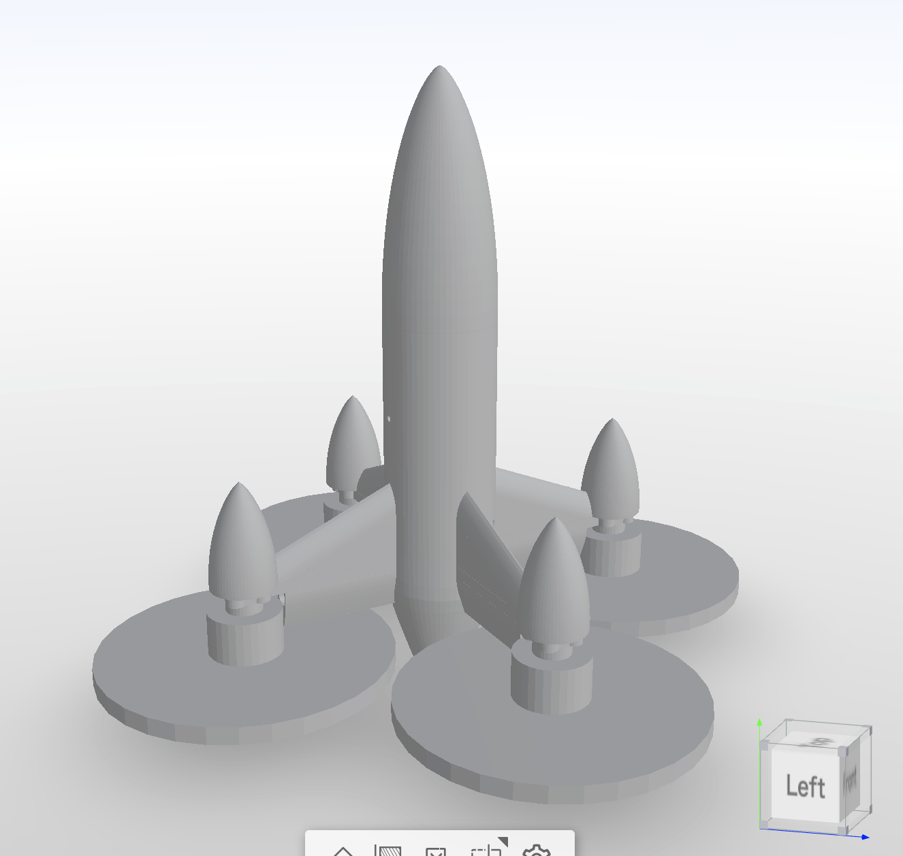

## 概要

6インチFPVドローンのフレームをコードから生成するプロジェクトです。

フレームは以下の2種類のパーツで構成されています:

- **Airframe** (3Dプリンター製): TOP / MIDDLE / BOTTOM の3部位
- **Structure** (CNCルーター製 CFRP): ARM × 4 / CENTER PLATE × 2 (TOP/BOTTOM)

### Airframe

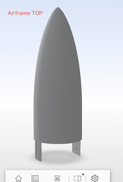
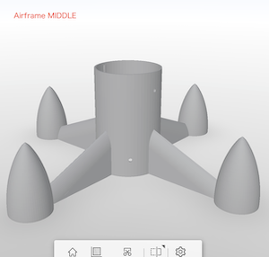
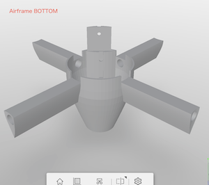

### Structure

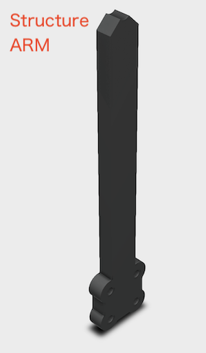
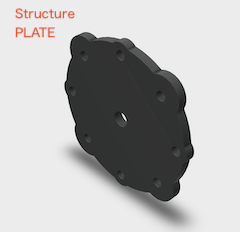

### 組み立てイメージ

電子部品などの取り付けイメージ
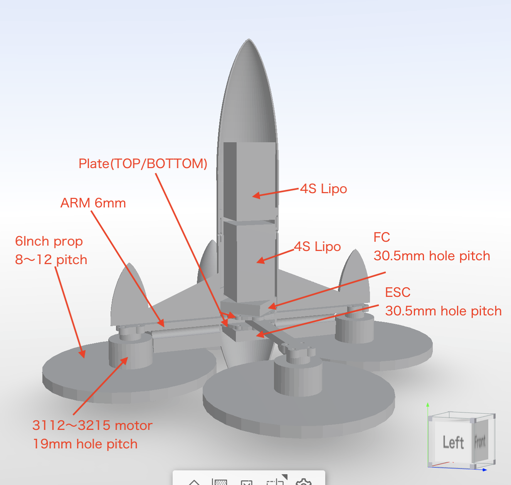

テスト印刷時のイメージ
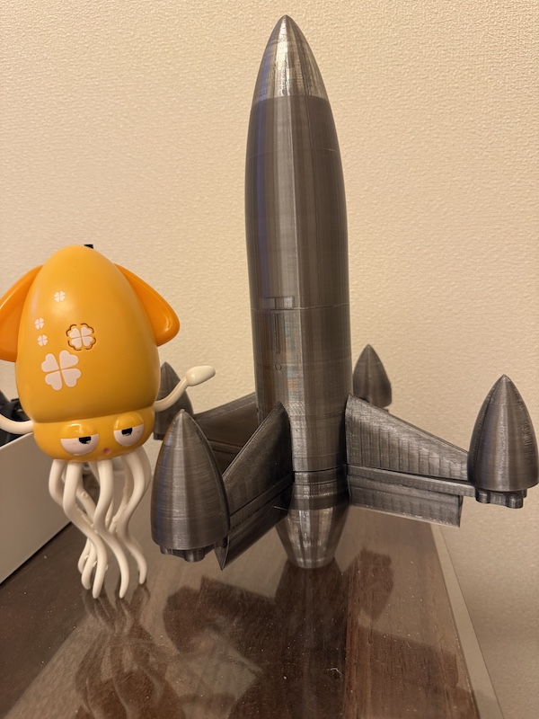

---

## ディレクトリ構成

```
.
├── base.py                 # Blender Python API ユーティリティモジュール
├── create_Airframe.py      # Airframe生成スクリプト (Blender bpy)
├── create_Structure.py     # Structure生成スクリプト (CadQuery) → STEP + G-code出力
├── generate_gcode.py       # STLからG-codeを生成するスクリプト
├── mdf/                    # 3Dプリンター用STLファイル
│   ├── Airframe_TOP.stl
│   ├── Airframe_MIDDLE.stl
│   └── Airframe_BOTTOM.stl
├── cnc/                    # CNCルーター用ファイル (STEP + G-code)
│   ├── 6INCH_ARM_param.step
│   ├── 6INCH_ARM_param.nc
│   ├── CENTER_PLATE_param.step
│   └── CENTER_PLATE_param.nc
├── example/                # サンプルスクリプト
│   └── example.py
└── img/                    # ドキュメント用画像
```

---

## Airframe (3Dプリンター)

### 必要な機材

- **3Dプリンター**: Bambu Lab A1 3D Printer
- **スライサー**: Bambu Studio

※ A1 miniだとサイズが収まらない可能性があります

### STLファイル

- [Airframe_TOP.stl](mdf/Airframe_TOP.stl)
- [Airframe_MIDDLE.stl](mdf/Airframe_MIDDLE.stl)
- [Airframe_BOTTOM.stl](mdf/Airframe_BOTTOM.stl)

### フィラメント

想定しているフィラメントはPET(G)-CFです。

- PA6-CFなどを使用する場合、印刷後にプライマーを塗布するなど吸湿対策が必須です
- 理想はPPA-CFですが、クロージャー型やノズル温度320度などの条件を満たすプリンターが必要です

---

## Structure (CNCルーター)

### 必要な機材

- **CNCルーター**: LUNYEE 3020 Nova Desktop CNC Router
- **CAMソフトウェア**: GRBLに対応したソフトウェア (公式ではUGSがサポートされています)

### 加工パラメータ

| パラメータ | 値 |
|---|---|
| 素材 | CFRP |
| ARMの厚み | 6mm |
| センタープレートの厚み | 3mm |
| エンドミル径 | 3mm (超硬2枚刃) |
| スピンドル回転数 | 15,000 RPM |
| XY送り速度 | 600 mm/min |
| Z送り速度 | 120 mm/min |
| 切り込み深さ | 0.5 mm/pass |

> ⚠️ CFRPの粉塵は有害です。集塵装置の使用とN95マスクの着用が必須です。

### NCファイル (G-code)

- [6INCH_ARM_param.nc](cnc/6INCH_ARM_param.nc)
- [CENTER_PLATE_param.nc](cnc/CENTER_PLATE_param.nc)

### STEPファイル

- [6INCH_ARM_param.step](cnc/6INCH_ARM_param.step)
- [CENTER_PLATE_param.step](cnc/CENTER_PLATE_param.step)

---

## カスタマイズ

### Airframe (Blender Python API)

Airframeの生成には[Blender Python API (bpy)](https://docs.blender.org/api/current/index.html)を使用しています。
モデリングをしなくても、Pythonスクリプトを実行するだけでモデルが生成されます。

#### 使い方

1. Blenderのスクリプティングワークスペースから下記のファイルを開きます

   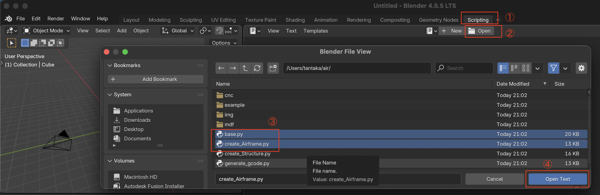

   - [base.py](base.py) — ユーティリティモジュール
   - [create_Airframe.py](create_Airframe.py) — メインスクリプト

   2枚開いている内の `create_Airframe.py` を選択します

   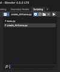

2. 作成したい部位の `False` をコメントアウトして実行します

   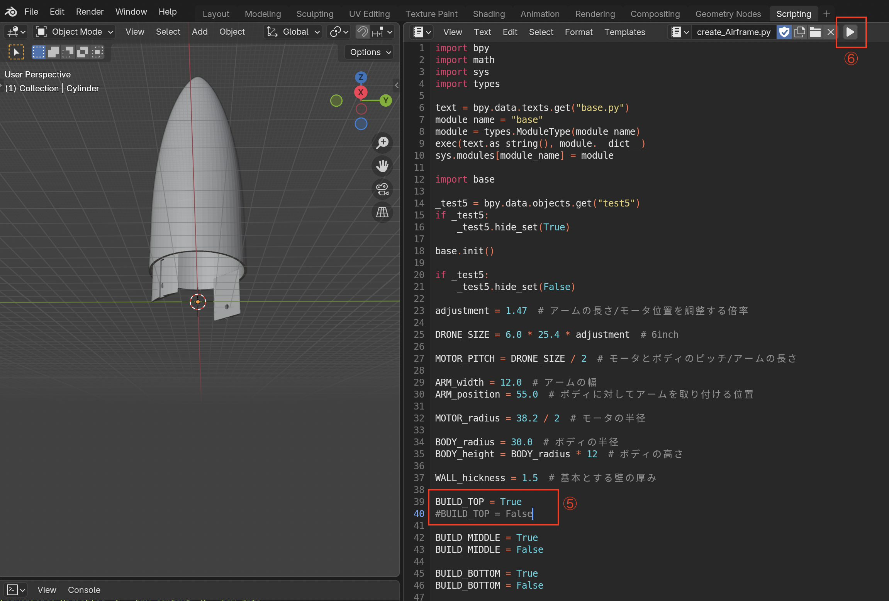

   例: BOTTOMを作成したい場合

   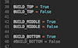

### Structure (CadQuery)

Structureの生成には[CadQuery](https://cadquery.readthedocs.io/)を使用しています。
`create_Structure.py` を実行すると、STEPファイルとG-codeが同時に生成されます。

```bash
python create_Structure.py
```

